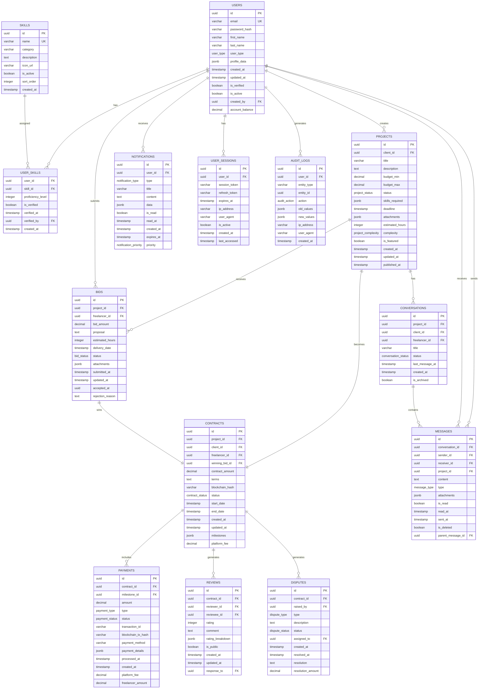

# MegiLance Database Design Specifications

See `README.md` in this folder for the docs index and related architecture docs.

This document provides comprehensive database design specifications for the MegiLance freelance marketplace platform, covering both SQL (PostgreSQL) and NoSQL (MongoDB) databases.

---

## 1. PostgreSQL Database Design (Primary/Enterprise Backend)

### 1.1 Database Schema Overview

The PostgreSQL database serves as the primary data store for transactional data, user management, and core business operations.

#### Entity Relationship Diagram (Mermaid)


### 1.2 Table Definitions

#### Users Table
```sql
CREATE TYPE user_type AS ENUM ('CLIENT', 'FREELANCER', 'ADMIN', 'MODERATOR');

CREATE TABLE users (
    id UUID PRIMARY KEY DEFAULT uuid_generate_v4(),
    email VARCHAR(255) UNIQUE NOT NULL,
    password_hash VARCHAR(255) NOT NULL,
    first_name VARCHAR(100) NOT NULL,
    last_name VARCHAR(100) NOT NULL,
    user_type user_type NOT NULL,
    profile_data JSONB DEFAULT '{}',
    created_at TIMESTAMP WITH TIME ZONE DEFAULT CURRENT_TIMESTAMP,
    updated_at TIMESTAMP WITH TIME ZONE DEFAULT CURRENT_TIMESTAMP,
    is_verified BOOLEAN DEFAULT FALSE,
    is_active BOOLEAN DEFAULT TRUE,
    created_by UUID REFERENCES users(id),
    account_balance DECIMAL(12,2) DEFAULT 0.00,
    
    CONSTRAINT valid_email CHECK (email ~* '^[A-Za-z0-9._%+-]+@[A-Za-z0-9.-]+\.[A-Za-z]{2,}$'),
    CONSTRAINT positive_balance CHECK (account_balance >= 0)
);

-- Indexes for users table
CREATE INDEX idx_users_email ON users(email);
CREATE INDEX idx_users_type ON users(user_type);
CREATE INDEX idx_users_active ON users(is_active);
CREATE INDEX idx_users_verified ON users(is_verified);
CREATE INDEX idx_users_created_at ON users(created_at);
CREATE INDEX idx_users_profile_data ON users USING GIN (profile_data);

-- Profile data structure example
-- {
--   "bio": "Experienced full-stack developer",
--   "location": {"country": "USA", "city": "New York", "timezone": "EST"},
--   "skills": ["JavaScript", "React", "Node.js"],
--   "hourly_rate": 50.00,
--   "availability": "full-time",
--   "portfolio_url": "https://portfolio.com",
--   "languages": [{"language": "English", "proficiency": "Native"}],
--   "education": [...],
--   "experience": [...],
--   "certifications": [...],
--   "social_links": {...},
--   "preferences": {...}
-- }
```

#### Projects Table
```sql
CREATE TYPE project_status AS ENUM (
    'DRAFT', 'OPEN', 'IN_PROGRESS', 'COMPLETED', 
    'CANCELLED', 'DISPUTED', 'CLOSED'
);

CREATE TYPE project_complexity AS ENUM ('SIMPLE', 'MODERATE', 'COMPLEX', 'EXPERT');

CREATE TABLE projects (
    id UUID PRIMARY KEY DEFAULT uuid_generate_v4(),
    client_id UUID NOT NULL REFERENCES users(id) ON DELETE CASCADE,
    title VARCHAR(255) NOT NULL,
    description TEXT NOT NULL,
    budget_min DECIMAL(12,2),
    budget_max DECIMAL(12,2),
    status project_status NOT NULL DEFAULT 'DRAFT',
    skills_required JSONB DEFAULT '[]',
    deadline TIMESTAMP WITH TIME ZONE,
    attachments JSONB DEFAULT '[]',
    estimated_hours INTEGER,
    complexity project_complexity DEFAULT 'MODERATE',
    is_featured BOOLEAN DEFAULT FALSE,
    created_at TIMESTAMP WITH TIME ZONE DEFAULT CURRENT_TIMESTAMP,
    updated_at TIMESTAMP WITH TIME ZONE DEFAULT CURRENT_TIMESTAMP,
    published_at TIMESTAMP WITH TIME ZONE,
    
    CONSTRAINT valid_budget CHECK (budget_min <= budget_max),
    CONSTRAINT positive_budget CHECK (budget_min >= 0 AND budget_max >= 0),
    CONSTRAINT valid_hours CHECK (estimated_hours > 0),
    CONSTRAINT future_deadline CHECK (deadline > created_at)
);

-- Indexes for projects table
CREATE INDEX idx_projects_client ON projects(client_id);
CREATE INDEX idx_projects_status ON projects(status);
CREATE INDEX idx_projects_created_at ON projects(created_at);
CREATE INDEX idx_projects_deadline ON projects(deadline);
CREATE INDEX idx_projects_budget ON projects(budget_min, budget_max);
CREATE INDEX idx_projects_skills ON projects USING GIN (skills_required);
CREATE INDEX idx_projects_featured ON projects(is_featured) WHERE is_featured = TRUE;
CREATE INDEX idx_projects_open ON projects(status, created_at) WHERE status = 'OPEN';

-- Full-text search index
CREATE INDEX idx_projects_search ON projects USING GIN (
    to_tsvector('english', title || ' ' || description)
);
```

#### Contracts Table
```sql
CREATE TYPE contract_status AS ENUM (
    'PENDING', 'ACTIVE', 'COMPLETED', 'CANCELLED', 
    'DISPUTED', 'TERMINATED', 'REFUNDED'
);

CREATE TABLE contracts (
    id UUID PRIMARY KEY DEFAULT uuid_generate_v4(),
    project_id UUID NOT NULL REFERENCES projects(id) ON DELETE CASCADE,
    client_id UUID NOT NULL REFERENCES users(id),
    freelancer_id UUID NOT NULL REFERENCES users(id),
    winning_bid_id UUID NOT NULL REFERENCES bids(id),
    contract_amount DECIMAL(12,2) NOT NULL,
    terms TEXT,
    blockchain_hash VARCHAR(255),
    status contract_status NOT NULL DEFAULT 'PENDING',
    start_date TIMESTAMP WITH TIME ZONE,
    end_date TIMESTAMP WITH TIME ZONE,
    created_at TIMESTAMP WITH TIME ZONE DEFAULT CURRENT_TIMESTAMP,
    updated_at TIMESTAMP WITH TIME ZONE DEFAULT CURRENT_TIMESTAMP,
    milestones JSONB DEFAULT '[]',
    platform_fee DECIMAL(12,2) NOT NULL DEFAULT 0.00,
    
    CONSTRAINT valid_amount CHECK (contract_amount > 0),
    CONSTRAINT valid_dates CHECK (end_date > start_date),
    CONSTRAINT valid_fee CHECK (platform_fee >= 0),
    CONSTRAINT different_parties CHECK (client_id != freelancer_id)
);

-- Milestones structure example
-- [
--   {
--     "id": "uuid",
--     "title": "Project Setup",
--     "description": "Initial project setup and planning",
--     "amount": 500.00,
--     "due_date": "2024-01-15T00:00:00Z",
--     "status": "pending",
--     "deliverables": ["Project plan", "Initial setup"]
--   }
-- ]
```

### 1.3 Advanced Features

#### Stored Procedures
```sql
-- Function to calculate user rating
CREATE OR REPLACE FUNCTION calculate_user_rating(user_uuid UUID)
RETURNS TABLE(average_rating DECIMAL, total_reviews INTEGER) AS $$
BEGIN
    RETURN QUERY
    SELECT 
        COALESCE(AVG(rating), 0)::DECIMAL(3,2) as average_rating,
        COUNT(*)::INTEGER as total_reviews
    FROM reviews 
    WHERE reviewee_id = user_uuid AND is_public = TRUE;
END;
$$ LANGUAGE plpgsql;

-- Function to get project recommendations
CREATE OR REPLACE FUNCTION get_project_recommendations(
    freelancer_uuid UUID, 
    limit_count INTEGER DEFAULT 10
)
RETURNS TABLE(
    project_id UUID,
    match_score DECIMAL,
    title VARCHAR,
    budget_max DECIMAL
) AS $$
BEGIN
    RETURN QUERY
    WITH freelancer_skills AS (
        SELECT skill_id, proficiency_level
        FROM user_skills 
        WHERE user_id = freelancer_uuid
    ),
    project_scores AS (
        SELECT 
            p.id,
            p.title,
            p.budget_max,
            -- Calculate match score based on skills overlap
            (
                SELECT COUNT(*) * 1.0 / GREATEST(jsonb_array_length(p.skills_required), 1)
                FROM freelancer_skills fs
                JOIN skills s ON fs.skill_id = s.id
                WHERE s.name = ANY(
                    SELECT jsonb_array_elements_text(p.skills_required)
                )
            ) as match_score
        FROM projects p
        WHERE p.status = 'OPEN'
        AND NOT EXISTS (
            SELECT 1 FROM bids b 
            WHERE b.project_id = p.id AND b.freelancer_id = freelancer_uuid
        )
    )
    SELECT 
        ps.id,
        ps.match_score,
        ps.title,
        ps.budget_max
    FROM project_scores ps
    WHERE ps.match_score > 0.2
    ORDER BY ps.match_score DESC, ps.budget_max DESC
    LIMIT limit_count;
END;
$$ LANGUAGE plpgsql;

-- Trigger to update user rating cache
CREATE OR REPLACE FUNCTION update_user_rating_cache()
RETURNS TRIGGER AS $$
BEGIN
    UPDATE users 
    SET profile_data = jsonb_set(
        COALESCE(profile_data, '{}'),
        '{rating_info}',
        (
            SELECT jsonb_build_object(
                'average_rating', avg_rating,
                'total_reviews', total_reviews,
                'last_updated', CURRENT_TIMESTAMP
            )
            FROM calculate_user_rating(
                CASE 
                    WHEN TG_OP = 'DELETE' THEN OLD.reviewee_id
                    ELSE NEW.reviewee_id
                END
            ) AS (avg_rating DECIMAL, total_reviews INTEGER)
        )
    )
    WHERE id = CASE 
        WHEN TG_OP = 'DELETE' THEN OLD.reviewee_id
        ELSE NEW.reviewee_id
    END;
    
    RETURN COALESCE(NEW, OLD);
END;
$$ LANGUAGE plpgsql;

CREATE TRIGGER trigger_update_user_rating
    AFTER INSERT OR UPDATE OR DELETE ON reviews
    FOR EACH ROW
    EXECUTE FUNCTION update_user_rating_cache();
```

#### Database Views
```sql
-- View for project statistics
CREATE VIEW project_stats AS
SELECT 
    p.id,
    p.title,
    p.status,
    p.budget_max,
    COUNT(b.id) as total_bids,
    AVG(b.bid_amount) as average_bid,
    MIN(b.bid_amount) as min_bid,
    MAX(b.bid_amount) as max_bid,
    p.created_at,
    EXTRACT(EPOCH FROM (CURRENT_TIMESTAMP - p.created_at))/3600 as hours_since_posted
FROM projects p
LEFT JOIN bids b ON p.id = b.project_id
GROUP BY p.id, p.title, p.status, p.budget_max, p.created_at;

-- View for user dashboard data
CREATE VIEW user_dashboard AS
SELECT 
    u.id,
    u.first_name,
    u.last_name,
    u.user_type,
    u.account_balance,
    CASE 
        WHEN u.user_type = 'CLIENT' THEN (
            SELECT jsonb_build_object(
                'active_projects', COUNT(*) FILTER (WHERE p.status IN ('OPEN', 'IN_PROGRESS')),
                'completed_projects', COUNT(*) FILTER (WHERE p.status = 'COMPLETED'),
                'total_spent', COALESCE(SUM(c.contract_amount) FILTER (WHERE c.status = 'COMPLETED'), 0)
            )
            FROM projects p
            LEFT JOIN contracts c ON p.id = c.project_id
            WHERE p.client_id = u.id
        )
        WHEN u.user_type = 'FREELANCER' THEN (
            SELECT jsonb_build_object(
                'active_contracts', COUNT(*) FILTER (WHERE c.status = 'ACTIVE'),
                'completed_contracts', COUNT(*) FILTER (WHERE c.status = 'COMPLETED'),
                'total_earned', COALESCE(SUM(c.contract_amount - c.platform_fee) FILTER (WHERE c.status = 'COMPLETED'), 0),
                'pending_bids', (SELECT COUNT(*) FROM bids WHERE freelancer_id = u.id AND status = 'SUBMITTED')
            )
            FROM contracts c
            WHERE c.freelancer_id = u.id
        )
    END as stats
FROM users u
WHERE u.is_active = TRUE;
```

---

## 2. MongoDB Database Design (AI/Analytics Backend)

### 2.1 Collection Schemas

#### User Activity Collection
```javascript
// user_activities
{
    "_id": ObjectId(),
    "user_id": "uuid-string",
    "session_id": "uuid-string",
    "activity_type": "page_view|search|project_view|bid_submit|message_send",
    "activity_data": {
        "page": "/projects/search",
        "search_query": "javascript react",
        "filters": {
            "budget_min": 100,
            "budget_max": 1000,
            "skills": ["javascript", "react"]
        },
        "results_count": 25,
        "clicked_projects": ["project-id-1", "project-id-2"]
    },
    "device_info": {
        "user_agent": "Mozilla/5.0...",
        "device_type": "desktop",
        "browser": "Chrome",
        "os": "Windows"
    },
    "ip_address": "192.168.1.1",
    "location": {
        "country": "US",
        "city": "New York",
        "coordinates": [40.7128, -74.0060]
    },
    "timestamp": ISODate(),
    "created_at": ISODate()
}

// Indexes for user_activities
db.user_activities.createIndex({ "user_id": 1, "timestamp": -1 })
db.user_activities.createIndex({ "activity_type": 1, "timestamp": -1 })
db.user_activities.createIndex({ "timestamp": -1 })
db.user_activities.createIndex({ "activity_data.search_query": "text" })
```

#### ML Training Data Collection
```javascript
// ml_training_data
{
    "_id": ObjectId(),
    "data_type": "user_project_interaction|skill_matching|success_prediction",
    "version": "1.0",
    "features": {
        "user_features": {
            "user_id": "uuid-string",
            "user_type": "freelancer",
            "experience_years": 5,
            "skills": ["javascript", "react", "node.js"],
            "skill_levels": {"javascript": 0.9, "react": 0.8, "node.js": 0.7},
            "avg_rating": 4.5,
            "total_projects": 15,
            "success_rate": 0.87,
            "response_time_hours": 2.5,
            "location": "US-NY",
            "timezone": "EST",
            "price_tier": "mid"
        },
        "project_features": {
            "project_id": "uuid-string",
            "title_embedding": [0.1, 0.2, ...], // 768-dim vector
            "description_embedding": [0.3, 0.4, ...],
            "required_skills": ["javascript", "react"],
            "budget_range": [500, 1000],
            "complexity_score": 0.6,
            "urgency_score": 0.3,
            "client_rating": 4.2,
            "client_projects_count": 8
        },
        "interaction_features": {
            "viewed": true,
            "bid_submitted": true,
            "bid_amount": 750,
            "bid_rank": 3,
            "proposal_length": 250,
            "response_time_minutes": 45
        }
    },
    "target": {
        "bid_accepted": true,
        "project_completed": true,
        "client_satisfaction": 5,
        "freelancer_satisfaction": 4,
        "completion_time_days": 12,
        "budget_variance": 0.05
    },
    "metadata": {
        "model_version": "v2.1",
        "feature_extraction_date": ISODate(),
        "data_quality_score": 0.95
    },
    "created_at": ISODate(),
    "updated_at": ISODate()
}

// Indexes for ml_training_data
db.ml_training_data.createIndex({ "data_type": 1, "version": 1 })
db.ml_training_data.createIndex({ "features.user_features.user_id": 1 })
db.ml_training_data.createIndex({ "features.project_features.project_id": 1 })
db.ml_training_data.createIndex({ "created_at": -1 })
```

#### Resume Analysis Collection
```javascript
// resume_analyses
{
    "_id": ObjectId(),
    "user_id": "uuid-string",
    "file_info": {
        "original_filename": "john_doe_resume.pdf",
        "s3_url": "s3://bucket/resumes/uuid-filename.pdf",
        "file_size": 2048576,
        "file_type": "application/pdf",
        "upload_timestamp": ISODate()
    },
    "extracted_text": "John Doe\nSoftware Engineer\n...",
    "analysis_results": {
        "personal_info": {
            "name": "John Doe",
            "email": "john@email.com",
            "phone": "+1-555-0123",
            "location": "New York, NY",
            "linkedin": "linkedin.com/in/johndoe"
        },
        "skills": {
            "technical_skills": [
                {
                    "skill": "JavaScript",
                    "confidence": 0.95,
                    "context": "5 years experience with React and Node.js"
                },
                {
                    "skill": "Python",
                    "confidence": 0.8,
                    "context": "Machine learning projects using TensorFlow"
                }
            ],
            "soft_skills": ["Leadership", "Communication", "Problem Solving"],
            "skill_categories": {
                "programming": ["JavaScript", "Python", "Java"],
                "frameworks": ["React", "Django", "Spring"],
                "tools": ["Git", "Docker", "AWS"]
            }
        },
        "experience": [
            {
                "company": "Tech Corp",
                "position": "Senior Software Engineer",
                "duration": "2020-2023",
                "description": "Led development of microservices architecture...",
                "responsibilities": ["Team leadership", "Architecture design"],
                "technologies": ["React", "Node.js", "AWS"]
            }
        ],
        "education": [
            {
                "institution": "State University",
                "degree": "Bachelor of Science in Computer Science",
                "graduation_year": 2018,
                "gpa": 3.8
            }
        ],
        "certifications": [
            {
                "name": "AWS Solutions Architect",
                "issuer": "Amazon",
                "date": "2022",
                "credential_id": "AWS-SA-12345"
            }
        ],
        "quality_metrics": {
            "overall_score": 8.5,
            "completeness_score": 9.0,
            "clarity_score": 8.0,
            "relevance_score": 8.5,
            "formatting_score": 8.0,
            "keyword_density": 0.12,
            "readability_score": 85
        },
        "recommendations": [
            {
                "type": "skill_enhancement",
                "message": "Consider adding cloud certifications to strengthen your profile",
                "priority": "medium"
            },
            {
                "type": "formatting",
                "message": "Use more action verbs in experience descriptions",
                "priority": "low"
            }
        ]
    },
    "embeddings": {
        "resume_embedding": [0.1, 0.2, 0.3, ...], // 768-dimensional
        "skills_embedding": [0.4, 0.5, 0.6, ...],
        "experience_embedding": [0.7, 0.8, 0.9, ...]
    },
    "processing_metadata": {
        "analysis_version": "v3.2",
        "processing_time_seconds": 12.5,
        "confidence_scores": {
            "text_extraction": 0.98,
            "skill_detection": 0.92,
            "experience_parsing": 0.88
        },
        "flags": {
            "potential_fraud": false,
            "incomplete_information": false,
            "formatting_issues": true
        }
    },
    "created_at": ISODate(),
    "updated_at": ISODate()
}

// Indexes for resume_analyses
db.resume_analyses.createIndex({ "user_id": 1 })
db.resume_analyses.createIndex({ "analysis_results.quality_metrics.overall_score": -1 })
db.resume_analyses.createIndex({ "analysis_results.skills.technical_skills.skill": 1 })
db.resume_analyses.createIndex({ "created_at": -1 })
```

#### Recommendation Engine Data
```javascript
// recommendations
{
    "_id": ObjectId(),
    "recommendation_type": "project_to_freelancer|freelancer_to_project|similar_projects",
    "user_id": "uuid-string",
    "target_id": "uuid-string", // project_id or user_id
    "algorithm_version": "collaborative_filtering_v2.1",
    "score": 0.85,
    "reasoning": {
        "primary_factors": [
            {
                "factor": "skill_match",
                "weight": 0.4,
                "score": 0.9,
                "details": "95% skill overlap with required technologies"
            },
            {
                "factor": "experience_relevance",
                "weight": 0.3,
                "score": 0.8,
                "details": "Similar project complexity and domain"
            },
            {
                "factor": "budget_compatibility",
                "weight": 0.2,
                "score": 0.85,
                "details": "Budget range aligns with freelancer's rate"
            },
            {
                "factor": "availability",
                "weight": 0.1,
                "score": 0.7,
                "details": "Freelancer available within project timeline"
            }
        ],
        "boost_factors": [
            {
                "factor": "high_rating",
                "boost": 0.05,
                "details": "4.8+ star rating"
            }
        ],
        "penalty_factors": []
    },
    "features_used": {
        "user_features": ["skills", "experience", "rating", "location"],
        "project_features": ["requirements", "budget", "complexity", "timeline"],
        "interaction_features": ["past_collaborations", "communication_history"]
    },
    "metadata": {
        "generated_at": ISODate(),
        "expires_at": ISODate(),
        "model_confidence": 0.92,
        "a_b_test_group": "treatment_v2"
    },
    "engagement_data": {
        "shown_to_user": false,
        "shown_at": null,
        "clicked": false,
        "clicked_at": null,
        "action_taken": null, // "bid_submitted", "profile_viewed", etc.
        "action_taken_at": null
    },
    "created_at": ISODate()
}

// Indexes for recommendations
db.recommendations.createIndex({ "user_id": 1, "score": -1 })
db.recommendations.createIndex({ "recommendation_type": 1, "created_at": -1 })
db.recommendations.createIndex({ "expires_at": 1 })
db.recommendations.createIndex({ "metadata.a_b_test_group": 1 })
```

### 2.2 Aggregation Pipelines

#### User Behavior Analytics Pipeline
```javascript
// Aggregate user search patterns
db.user_activities.aggregate([
    {
        $match: {
            activity_type: "search",
            timestamp: { $gte: ISODate("2024-01-01") }
        }
    },
    {
        $group: {
            _id: {
                user_id: "$user_id",
                search_query: "$activity_data.search_query"
            },
            search_count: { $sum: 1 },
            avg_results: { $avg: "$activity_data.results_count" },
            total_clicks: { $sum: { $size: "$activity_data.clicked_projects" } },
            last_search: { $max: "$timestamp" }
        }
    },
    {
        $group: {
            _id: "$_id.user_id",
            search_patterns: {
                $push: {
                    query: "$_id.search_query",
                    frequency: "$search_count",
                    avg_results: "$avg_results",
                    click_through_rate: { $divide: ["$total_clicks", "$search_count"] }
                }
            },
            total_searches: { $sum: "$search_count" }
        }
    },
    {
        $project: {
            user_id: "$_id",
            search_patterns: 1,
            total_searches: 1,
            most_frequent_searches: {
                $slice: [
                    { $sortArray: { input: "$search_patterns", sortBy: { frequency: -1 } } },
                    5
                ]
            }
        }
    }
])
```

#### Project Success Prediction Pipeline
```javascript
// Analyze successful project patterns
db.ml_training_data.aggregate([
    {
        $match: {
            data_type: "user_project_interaction",
            "target.project_completed": true
        }
    },
    {
        $group: {
            _id: {
                client_rating_tier: {
                    $switch: {
                        branches: [
                            { case: { $gte: ["$features.project_features.client_rating", 4.5] }, then: "high" },
                            { case: { $gte: ["$features.project_features.client_rating", 3.5] }, then: "medium" }
                        ],
                        default: "low"
                    }
                },
                budget_tier: {
                    $switch: {
                        branches: [
                            { case: { $gte: [{ $avg: "$features.project_features.budget_range" }, 1000] }, then: "high" },
                            { case: { $gte: [{ $avg: "$features.project_features.budget_range" }, 500] }, then: "medium" }
                        ],
                        default: "low"
                    }
                }
            },
            success_rate: { $avg: { $cond: ["$target.project_completed", 1, 0] } },
            avg_completion_time: { $avg: "$target.completion_time_days" },
            avg_satisfaction: { $avg: "$target.client_satisfaction" },
            project_count: { $sum: 1 }
        }
    },
    {
        $sort: { success_rate: -1 }
    }
])
```

---

## 3. Data Migration and Synchronization

### 3.1 PostgreSQL to MongoDB Sync
```javascript
// Sync user profile updates to MongoDB for ML processing
function syncUserProfileToMongoDB(userId, profileData) {
    db.user_profiles.updateOne(
        { user_id: userId },
        {
            $set: {
                user_id: userId,
                profile_data: profileData,
                skills_vector: generateSkillsVector(profileData.skills),
                experience_score: calculateExperienceScore(profileData.experience),
                last_synced: new Date()
            }
        },
        { upsert: true }
    );
}
```

### 3.2 Real-time Event Streaming
```sql
-- PostgreSQL trigger for real-time sync
CREATE OR REPLACE FUNCTION notify_profile_change()
RETURNS TRIGGER AS $$
BEGIN
    PERFORM pg_notify(
        'profile_changed',
        json_build_object(
            'user_id', NEW.id,
            'profile_data', NEW.profile_data,
            'timestamp', CURRENT_TIMESTAMP
        )::text
    );
    RETURN NEW;
END;
$$ LANGUAGE plpgsql;

CREATE TRIGGER trigger_profile_change
    AFTER UPDATE OF profile_data ON users
    FOR EACH ROW
    EXECUTE FUNCTION notify_profile_change();
```

This comprehensive database design provides a robust foundation for the MegiLance platform, supporting both transactional operations and advanced analytics/ML capabilities.