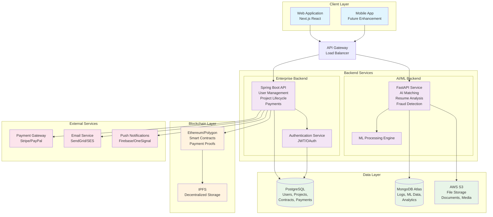
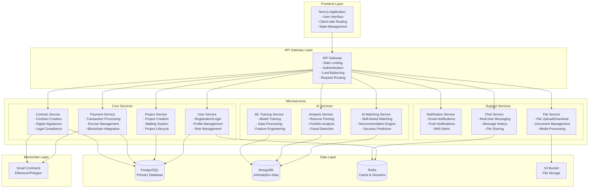
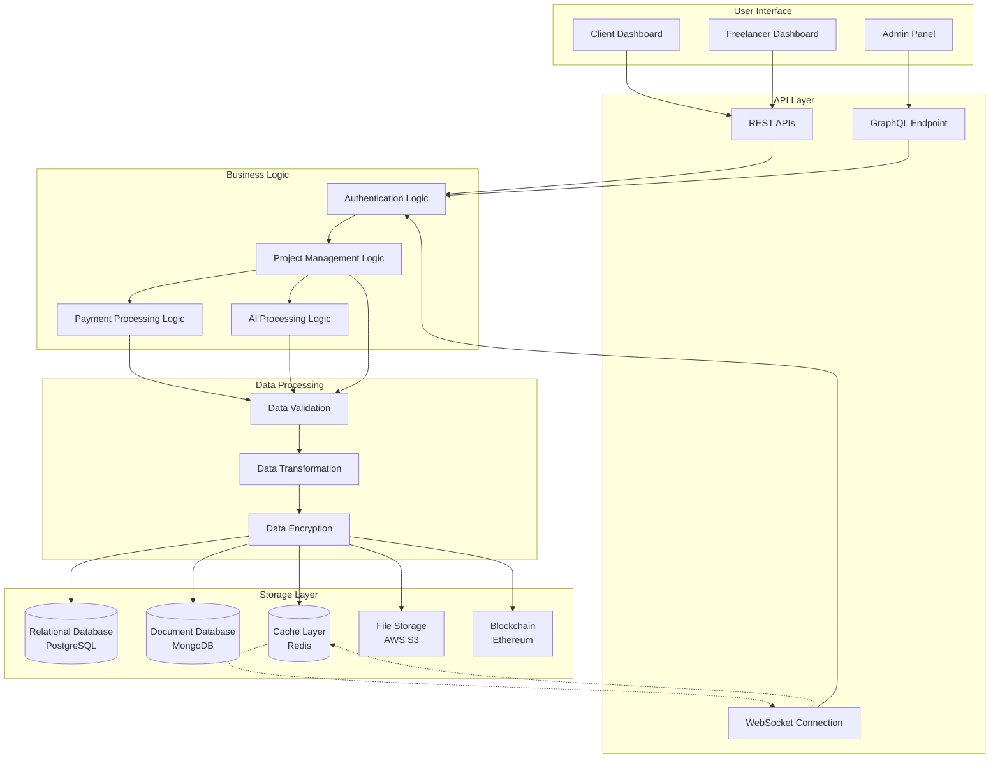
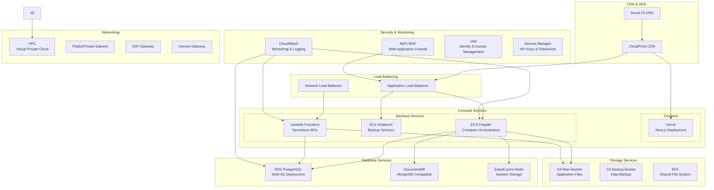
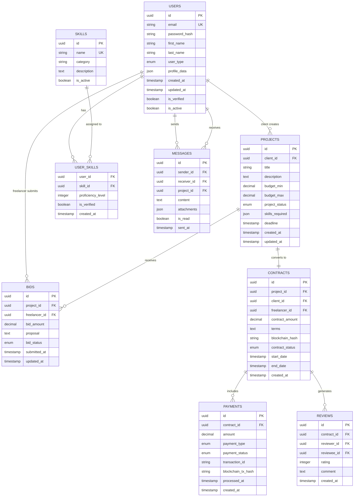
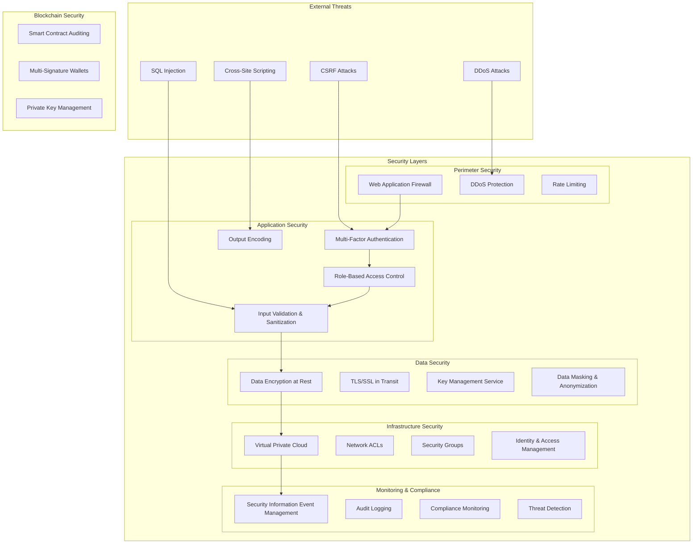
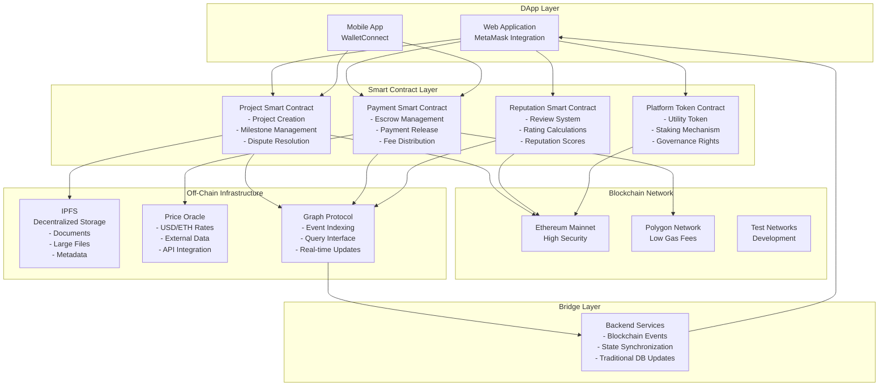

# MegiLance System Architecture Diagrams

Canonical source for system diagrams. The old preview file `DiagramsPreview.md` now redirects here.

This document contains comprehensive architectural diagrams for the MegiLance freelance marketplace platform.

---

## 1. High-Level System Architecture

---

## 2. Microservices Architecture Detail

---

## 3. Data Flow Architecture

---

## 4. Cloud Deployment Architecture (AWS)

---

## 5. Database Schema Architecture

---

## 6. Security Architecture

---

## 7. CI/CD Pipeline Architecture

```mermaid
flowchart LR
    subgraph "Source Control"
        GitHub[GitHub Repository]
        Branches[Feature Branches]
    end

    subgraph "CI Pipeline"
        Trigger[Webhook Trigger]
        Build[Build Process]
        Test[Automated Testing]
        Security[Security Scanning]
        Quality[Code Quality Check]
    end

    subgraph "Artifact Management"
        Registry[Container Registry]
        S3Artifacts[S3 Artifact Storage]
    end

    subgraph "CD Pipeline"
        Dev[Development Environment]
        Staging[Staging Environment]
        Prod[Production Environment]
    end

    subgraph "Deployment"
        Infrastructure[Infrastructure as Code]
        Containers[Container Orchestration]
        Database[Database Migration]
        Configuration[Configuration Management]
    end

    subgraph "Monitoring"
        HealthCheck[Health Checks]
        Metrics[Performance Metrics]
        Alerts[Alert System]
        Rollback[Automatic Rollback]
    end

    %% Flow
    GitHub --> Trigger
    Branches --> Trigger
    Trigger --> Build
    Build --> Test
    Test --> Security
    Security --> Quality
    Quality --> Registry
    Quality --> S3Artifacts
    
    Registry --> Dev
    Dev --> Staging
    Staging --> Prod
    
    Prod --> Infrastructure
    Infrastructure --> Containers
    Containers --> Database
    Database --> Configuration
    
    Configuration --> HealthCheck
    HealthCheck --> Metrics
    Metrics --> Alerts
    Alerts --> Rollback
```

---

## 8. Blockchain Integration Architecture

---

This comprehensive set of diagrams covers all aspects of your MegiLance system architecture, from high-level system design to detailed implementation specifics. Each diagram serves a specific purpose in documenting and communicating different aspects of your system design.